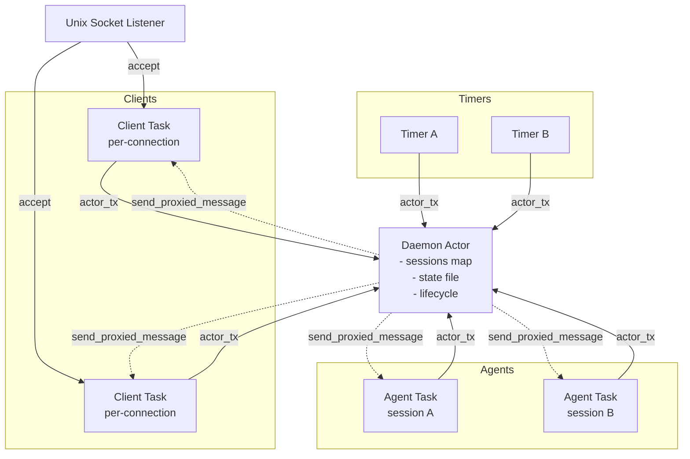
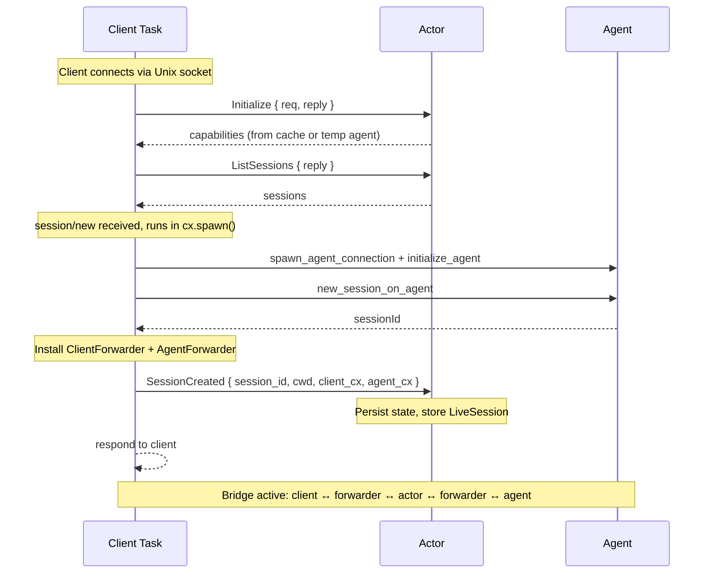
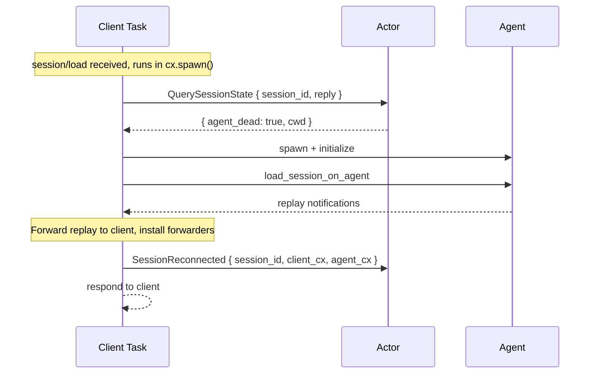
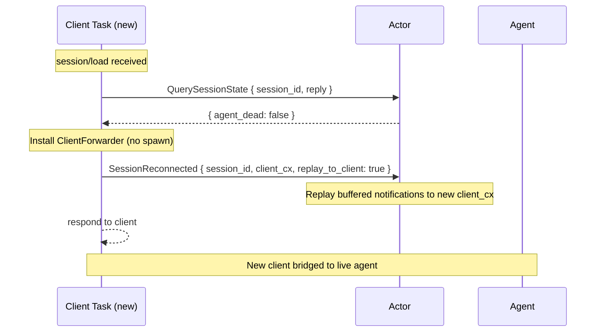
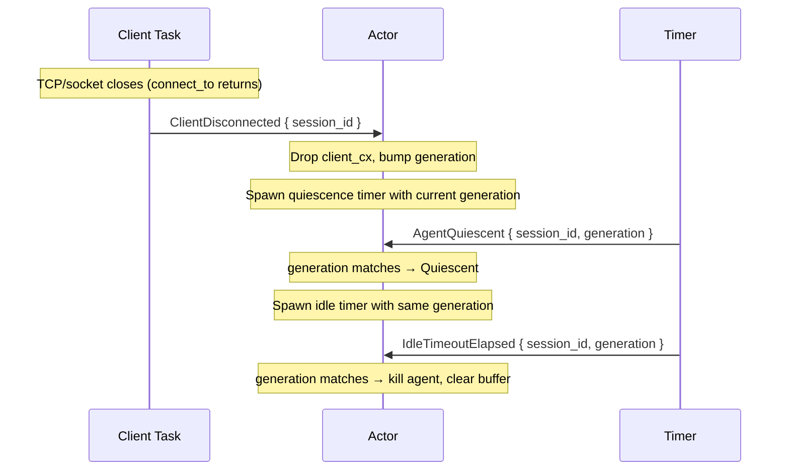
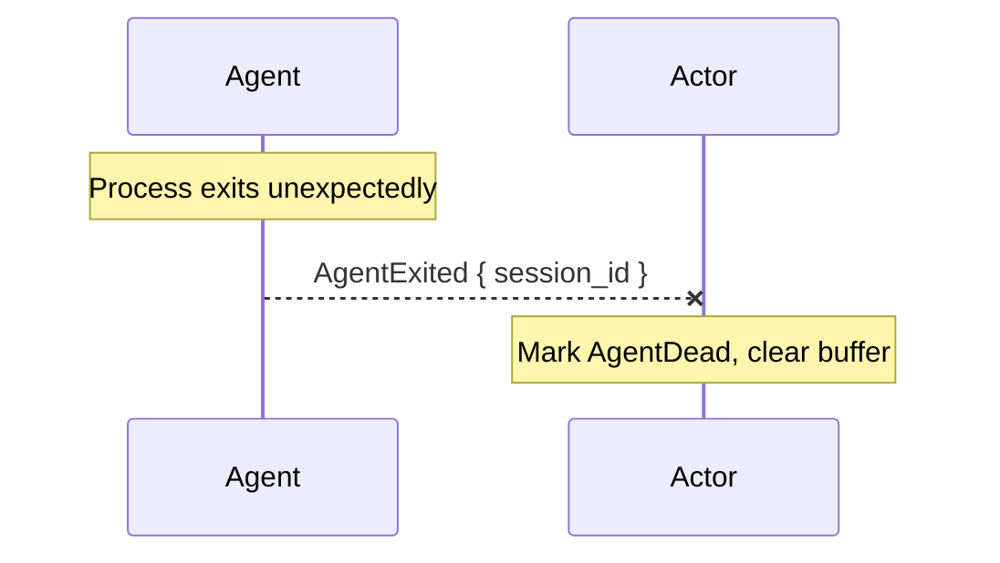
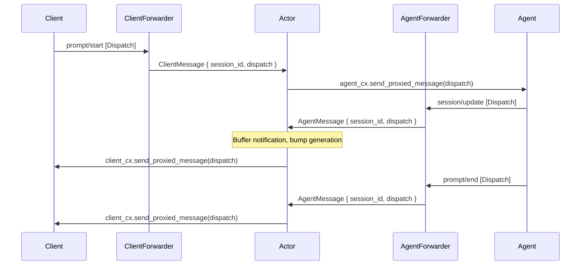

# Daemon actor architecture

The daemon uses a **central actor** pattern: a single task owns all mutable session state and processes events sequentially from an mpsc channel. Client connections, agent connections, and timers all communicate with the actor by sending messages into this channel. This eliminates shared mutable state (`Arc<Mutex<...>>`) and ensures lifecycle transitions are race-free.

## Architecture overview



The key invariant: **only the actor task reads or writes session state**. Everything else sends a `DaemonMessage` and (optionally) awaits a reply via a oneshot channel.

## Message types

The actor has two distinct enums: **`DaemonMessage`** (inputs that drive the actor) and **`LifecycleEvent`** (outcomes emitted for observers).

### `DaemonMessage` — inputs to the actor

```{anchor}
daemon-message
```

**Key design constraint**: `send_request(...).block_task().await` can only be called from within `cx.spawn()` or a `connect_with` callback — NOT from the actor task. Therefore agent spawn + initialize + session/new must run in the client handler task ({anchor}`handle-session-new`). The actor receives the results as fire-and-forget registration messages (`SessionCreated`, `SessionReconnected`).

### `LifecycleEvent` — outcomes for observers

```{anchor}
lifecycle-event
```

The actor emits `LifecycleEvent` values into a separate unbounded channel for subscribers (tests, tracing). These are purely observational — the actor never receives them back.

## Fresh connection — new session (internal)



Source: {anchor}`handle-session-new`

## Reconnect — load session, agent dead (internal)



Source: {anchor}`handle-session-load`

## Reconnect — load session, agent alive (internal)



Source: {anchor}`handle-session-load`

## Client disconnect and idle spin-down (internal)



Source: {anchor}`disconnect-and-idle`

## Agent crash detection (internal)



Source: {anchor}`handle-agent-exited`

Note: respawn is not currently implemented in the actor (requires independent agent connections).

## Message flow through the bridge

During normal operation, forwarders route messages through the actor:



Source: {anchor}`route-messages`

## Design principles

**Single writer**: The actor is the sole owner of `sessions: HashMap<String, LiveSession>`. No mutexes needed for session state.

**Inputs vs events**: `DaemonMessage` is what the actor processes; `DaemonEvent` is what it emits. Tests subscribe to the event channel and assert on outcomes. The two enums are cleanly separated — no variant appears in both.

**Request-reply via oneshot**: Client tasks that need a response (e.g., `SessionNew`) include a `tokio::sync::oneshot::Sender` in the message. The actor computes the answer and sends it back. The client task awaits the oneshot.

**Fire-and-forget for events**: Messages like `ClientDisconnected`, `AgentExited`, and timer expirations don't need replies — the actor handles them unilaterally.

**Timers as messages**: Instead of spawning timer tasks that grab mutexes, the actor spawns lightweight tasks that simply sleep and then send `AgentQuiescent` / `IdleTimeoutElapsed` back to the actor channel. The actor checks whether the timer is still relevant (client may have reconnected) before acting.

**Agent task isolation**: Each live agent has a dedicated task that reads from the agent's stdio and sends `AgentMessage { session_id, message }` into the actor channel. The actor decides what to do with each message (buffer it, forward to client, update lifecycle state). If the agent process exits, the task sends `AgentExited`.
