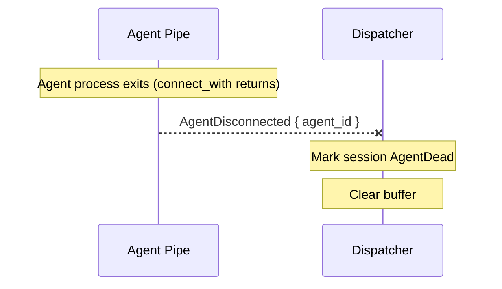

# Agent crash detection

When an agent process exits unexpectedly, the dispatcher marks the session as dead. The next client to connect will trigger a fresh agent spawn via the normal load/resume path.



## How it works

The agent runs inside a `connect_with` callback in a task spawned by the dispatcher (`self.tasks.spawn(...)`). When the agent process exits (or the connection drops), the `connect_with` future completes. The agent pipe then sends `DispatcherMessage::AgentDisconnected { agent_id }` to the dispatcher.

The dispatcher's handler removes the agent handle, looks up the session via `agent_to_session`, and marks it dead:

```{anchor}
handle-agent-exited
```

## What about respawn?

The design originally called for automatic respawn (spawn a new agent, send `session/load`, re-install bridge). This is not currently implemented because it requires independent agent connections — the same limitation that blocks the idle-timeout tests.

When a client later calls `session/load` or `session/resume`, `handle_session_load` / `handle_session_resume` will see `lifecycle_state == AgentDead` and spawn a fresh agent pipe at that point.

## Integration tests

*None yet* — testing crash detection requires independent agent connections.
