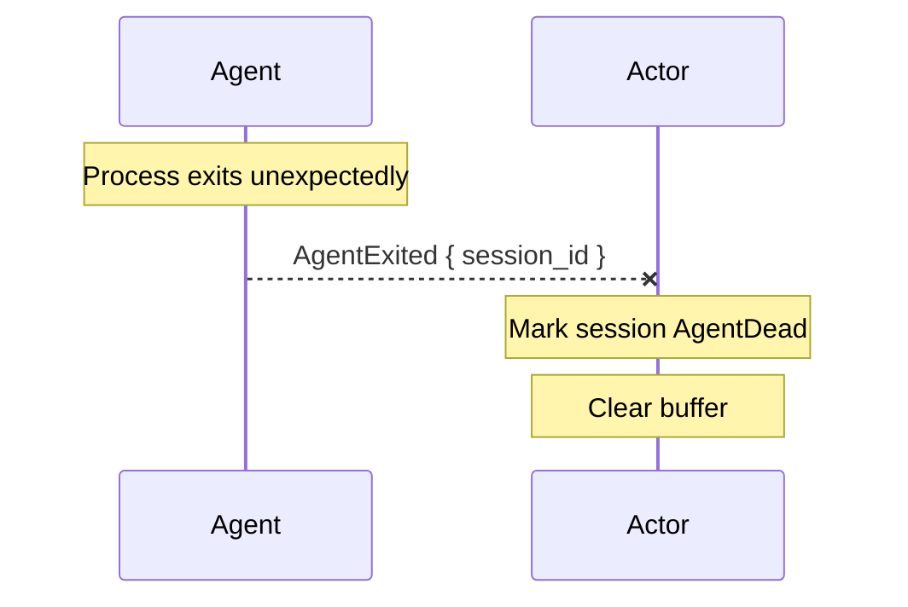

# Agent crash detection

When an agent process exits unexpectedly, the actor marks the session as dead. The next client to connect will trigger a fresh agent spawn via the normal load/resume path.



## How it works

The agent runs inside a `connect_with` callback in a spawned task. When the agent process exits (or the connection drops), the `connect_with` future completes. The spawned task then sends `DaemonMessage::AgentExited` to the actor.

The actor's handler simply marks the session dead and clears the notification buffer:

```{anchor}
handle-agent-exited
```

## What about respawn?

The design originally called for automatic respawn (spawn a new agent, send `session/load`, re-install bridge). This is not currently implemented because it requires independent agent connections — the same limitation that blocks the idle-timeout tests.

When a client later calls `session/load` or `session/resume`, the `QuerySessionState` reply will indicate `agent_dead: true`, and the client task will spawn a fresh agent at that point.

## Integration tests

*None yet* — testing crash detection requires independent agent connections.
