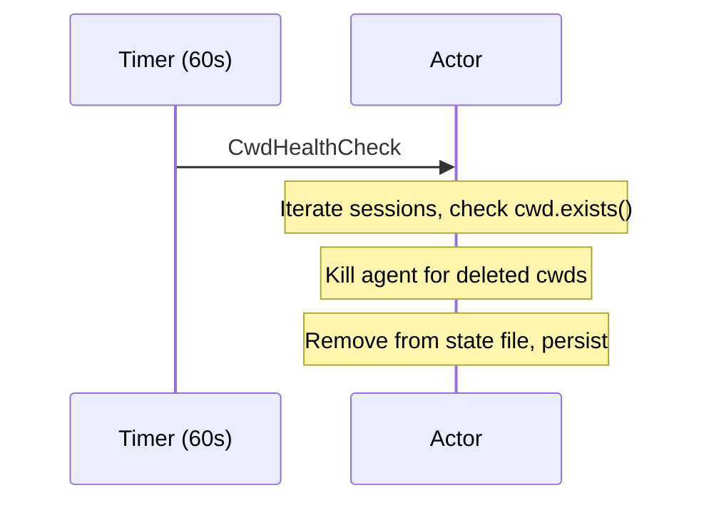

# Directory deleted — session cleanup

The daemon periodically checks whether each session's working directory still exists. If a directory has been deleted (e.g., `rm -rf /tmp/project`), the session is removed from both memory and the persistent state file.



## How it works

### Timer

A dedicated task sends `DaemonMessage::CwdHealthCheck` every 60 seconds:

```{anchor}
cwd-health-check-timer
```

### Cleanup logic

The actor iterates all sessions, identifies those whose `cwd` no longer exists, kills their agents (drops the connection handle), removes them from the in-memory map and persistent state, and saves:

```{anchor}
cwd-health-check
```

## Integration tests

*None yet.*
