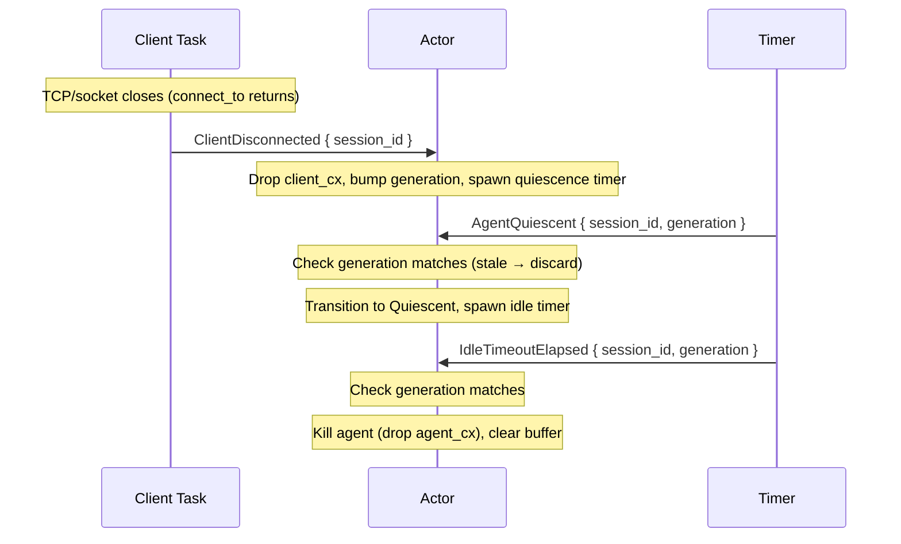

# Idle spin-down

When all clients disconnect from a session, the daemon doesn't kill the agent immediately. It waits through two phases — quiescence (is the pipe truly silent?) and idle timeout (has enough wall-clock time passed?) — before terminating the agent process.



## How it works

### Client disconnect detection

When the ACP `connect_to(transport).await` returns (socket closed), the client task sends `ClientDisconnected` to the actor before exiting.

```{anchor}
client-disconnect
```

### Generation-counter timer pattern

The actor doesn't track or abort timer tasks. Instead, each session has a monotonic `generation` counter that increments on every state change (client connects, message activity, reconnect). Timer tasks carry the generation they were spawned at. When the timer fires and sends its message back to the actor, the actor compares generations — if they differ, the timer is stale and discarded.

This eliminates the need for `JoinHandle` tracking or `.abort()` calls. Sleeping tasks are harmless — they just produce ignored messages.

```{anchor}
disconnect-and-idle
```

### Lifecycle state transitions

```text
Active → (client disconnects) → spawn quiescence timer
       → AgentQuiescent (gen matches) → Quiescent → spawn idle timer  
       → IdleTimeoutElapsed (gen matches) → kill agent → AgentDead
```

If a client reconnects at any point, the generation bumps and both timers become stale.

## Integration tests

- `integration::agent_killed_after_idle_timeout` *(ignored — requires independent agent connections)*

## Known limitation

The idle spin-down cannot be tested with in-process `RhaiAgent` because `spawn_connection` ties the agent's lifetime to the parent client connection. When the client disconnects, the parent ACP connection doesn't close (it waits for the child agent connection), so `ClientDisconnected` is never emitted. This requires independent agent connections to resolve.
