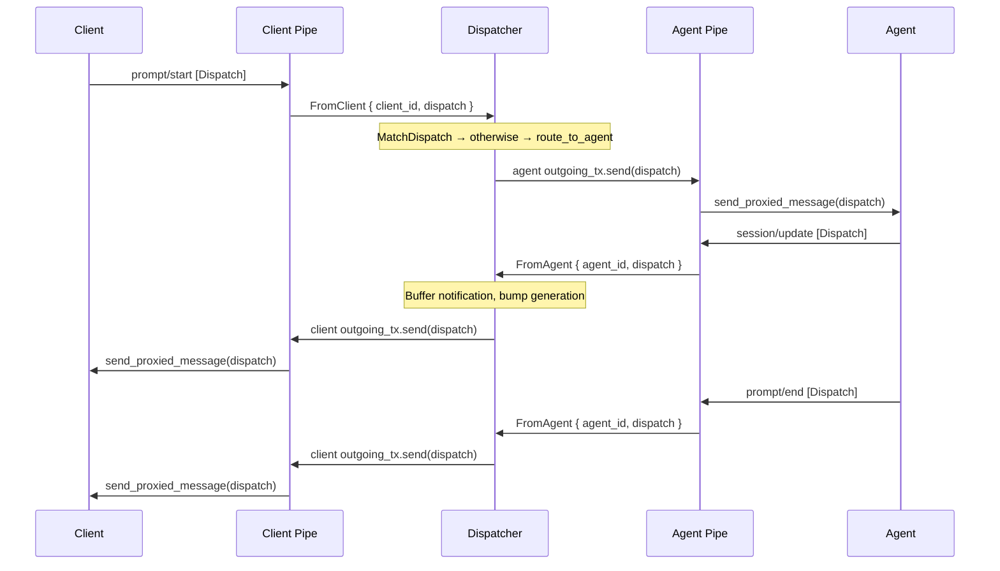

# Message bridge

During normal operation (session established, client connected), all ACP messages flow bidirectionally through the dispatcher via channel-based forwarding. This is the steady-state data path.



## How forwarding works

### Client side

The `client_pipe` uses `on_receive_dispatch` to capture every dispatch from the client and forward it to the dispatcher as `FromClient { client_id, dispatch }`. It also reads from an `mpsc::UnboundedReceiver<Dispatch>` and calls `send_proxied_message` to write dispatches back to the client's transport.

### Agent side

The `agent_pipe` installs an `AgentDispatchForwarder` dynamic handler (`HandleDispatchFrom<Agent>`) after the session is established. This captures every dispatch from the agent and sends `FromAgent { agent_id, dispatch }` to the dispatcher. The agent pipe also reads from an `mpsc::UnboundedReceiver<Dispatch>` and calls `send_proxied_message` to write dispatches to the agent's transport.

Both forwarders return `Handled::Yes` — consuming the dispatch so no other handler processes it.

## Dispatcher routing logic

When the dispatcher receives a `FromClient` dispatch, `MatchDispatch` tries each typed handler (initialize, list sessions, new session, load session, resume session). If none match, the `otherwise` branch calls `route_to_agent`, which looks up the client's session and sends the dispatch to the agent's `outgoing_tx`.

For `FromAgent`, the dispatcher buffers notifications (for future replay), bumps the generation counter, and sends the dispatch to the most-recently-connected client (`session.client_ids.last()`) via their `outgoing_tx`.

```{anchor}
route-messages
```

## Why `send_proxied_message`?

`send_proxied_message` preserves the original request/response correlation. When a client sends a `PromptRequest`, the dispatch carries an ID. The agent processes it and sends a `PromptResponse` with the same ID. The dispatcher is a transparent passthrough — no correlation tracking needed on our side. The ACP framework handles matching responses to pending requests at each endpoint.

Note: `send_proxied_message` is internal to the ACP pipe tasks (client pipe and agent pipe). The dispatcher itself communicates with pipes via `outgoing_tx.send(dispatch)` — a channel send, not a direct transport write.

## Integration tests

- `integration::basic_session_prompt_response` — full round-trip prompt/response through the bridge
