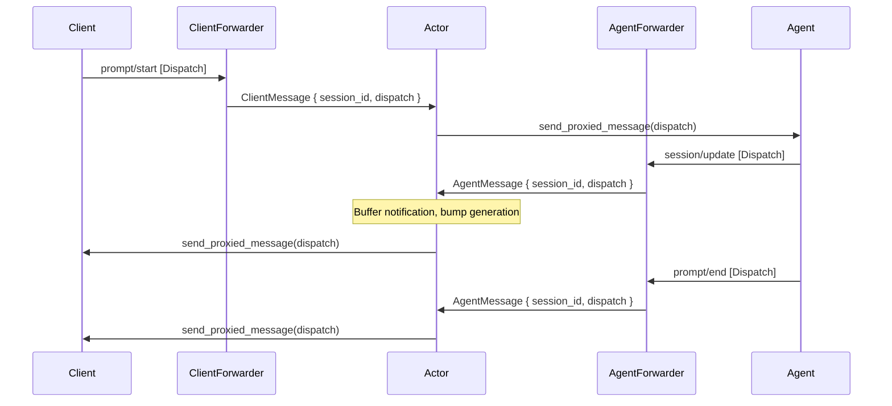

# Message bridge

During normal operation (session established, client connected), all ACP messages flow bidirectionally through the actor via forwarder handlers. This is the steady-state data path.



## How forwarders work

Forwarders are dynamic handlers installed on ACP connections via `add_dynamic_handler(...).run_indefinitely()`. They implement `HandleDispatchFrom<T>` and capture every dispatch that isn't consumed by a typed request handler.

- **ClientForwarder** — installed on the client's `ConnectionTo<Client>`. Captures dispatches from the client (prompts, tool results, etc.) and sends `DaemonMessage::ClientMessage` to the actor.

- **AgentForwarder** — installed on the agent's `ConnectionTo<Agent>`. Captures dispatches from the agent (responses, notifications) and sends `DaemonMessage::AgentMessage` to the actor.

Both return `Handled::Yes` — consuming the dispatch so no other handler processes it.

## Actor routing logic

When the actor receives a `ClientMessage`, it looks up the session and calls `agent_cx.send_proxied_message(dispatch)` to forward to the agent. For `AgentMessage`, it buffers notifications, bumps the generation counter, and calls `client_cx.send_proxied_message(dispatch)` to forward to the client.

```{anchor}
route-messages
```

## Why `send_proxied_message`?

`send_proxied_message` preserves the original request/response correlation. When a client sends a `PromptRequest`, the dispatch carries an ID. The agent processes it and sends a `PromptResponse` with the same ID. The actor is a transparent passthrough — no correlation tracking needed on our side. The ACP framework handles matching responses to pending requests at each endpoint.

## Integration tests

- `integration::basic_session_prompt_response` — full round-trip prompt/response through forwarders
