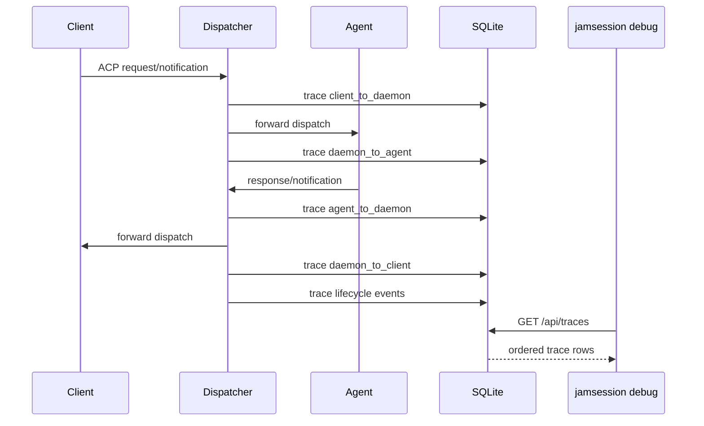

# Flow: message trace

When `[daemon] trace = true`, the dispatcher records ACP dispatches and lifecycle events to the `traces` table in `jamsession.db`. Trace writes are best-effort: failures are logged and do not interrupt ACP routing.

## Trace points

The dispatcher writes rows when it receives dispatches from clients, forwards dispatches to agents, receives dispatches from agents, forwards dispatches to clients, and observes lifecycle events such as client connect/disconnect, agent spawn/quiescence/idle kill, and session create/load/resume.

Local daemon responses, such as `session/new` and `session/list`, are captured by wrapping their typed responders. The wrapper sends a `ResponseSent` message back through the dispatcher channel and then returns the original response unchanged.

## Debug viewer

`jamsession debug` serves a localhost-only static page and `/api/traces`. The page polls every 200ms with `after_id` to tail new rows and can filter by session, method, and direction.
