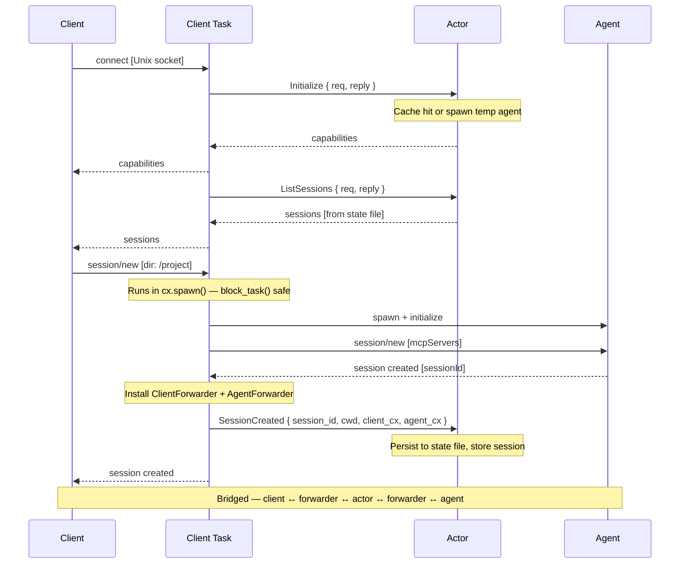

# Fresh connection — new session

This is the happy path: a client connects for the first time, discovers what sessions exist, and creates a new one.



## Step by step

### 1. Accept loop

The daemon listens on a Unix socket. Each incoming connection spawns a new client task that owns the ACP connection for the lifetime of that socket.

```{anchor}
accept-loop
```

### 2. Client task (`handle_client`)

Each client task establishes an ACP connection as the "Agent" side (because the daemon presents as an agent to the client). It registers typed request handlers for `Initialize`, `ListSessions`, `NewSession`, `LoadSession`, and `ResumeSession`. Each handler sends a message to the actor and awaits a reply via a oneshot channel.

The key constraint: **`send_request(...).block_task().await` can only be called from within `cx.spawn()`** (the connection's task pool). So operations that need to talk to an agent (spawn, initialize, session/new) run inside `cx.spawn(...)`, while simple request/reply queries to the actor can use a oneshot directly.

After a session is established, a `ClientForwarder` dynamic handler is installed. It captures all subsequent dispatches (prompts, tool calls, etc.) and routes them to the actor as `ClientMessage`. This is the bridge's client-side half.

```{anchor}
handle-client
```

### 3. Initialize

The client sends `initialize` with its capabilities. The client task forwards this to the actor, which either returns cached capabilities or probes a temp agent (cold start, happens once).

```{anchor}
handle-initialize
```

### 4. List sessions

A simple request/reply through the actor — returns session records from the persistent state file.

```{anchor}
handle-session-list
```

### 5. Session/new dispatch

The ACP `on_receive_request` handler for `NewSessionRequest`. It spawns a task via `cx.spawn()` (required for `block_task()`) and delegates to `handle_session_new`.

```{anchor}
dispatch-session-new
```

### 6. Session/new implementation

The core logic: spawn the agent process, initialize the ACP protocol, send `session/new`, install forwarders, then register the session with the actor.

```{anchor}
handle-session-new
```

### 7. Message routing (bridged mode)

Once the session is established, all subsequent dispatches flow through forwarders → actor → `send_proxied_message`. The actor buffers notifications for future replay.

```{anchor}
route-messages
```

## Integration tests

- `daemon_startup::daemon_creates_socket_file` — connect step
- `daemon_startup::daemon_accepts_connection_and_responds_to_initialize` — initialize exchange
- `daemon_startup::session_list_returns_empty` — session/list on fresh daemon
- `session_lifecycle::new_session_creates_session_and_returns_id` — full session/new flow
- `session_lifecycle::new_session_persists_to_state_file` — state file persistence
- `session_lifecycle::session_list_shows_created_session` — session/list after create
- `session_lifecycle::new_session_with_invalid_cwd_returns_error` — error path
- `integration::basic_session_prompt_response` — end-to-end prompt through routing
- `integration::multiple_sessions_independent` — two sessions, independent agents
