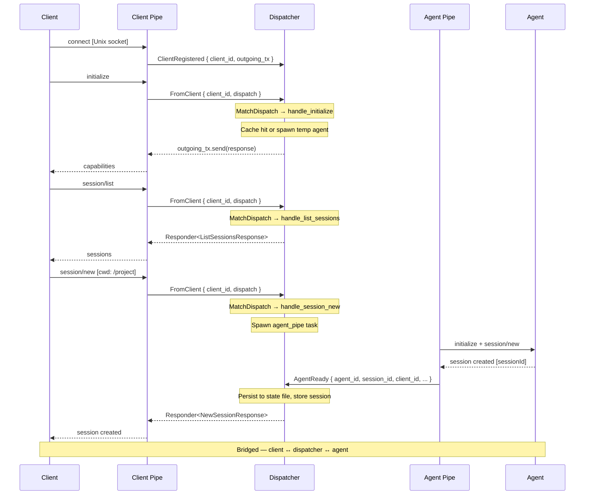

# Fresh connection — new session

This is the happy path: a client connects for the first time, discovers what sessions exist, and creates a new one.



## Step by step

### 1. Accept loop

The daemon listens on a Unix socket. Each incoming connection spawns a `client_pipe` task that owns the ACP connection for the lifetime of that socket.

```{anchor}
accept-loop
```

### 2. Client pipe

Each client pipe establishes an ACP connection as the "Agent" side (because the daemon presents as an agent to the client). It uses `on_receive_dispatch` to capture all incoming dispatches and forward them to the dispatcher as `FromClient { client_id, dispatch }`. Outgoing messages from the dispatcher arrive via an `mpsc::UnboundedReceiver<Dispatch>` and are written back to the client using `send_proxied_message`.

The `EofSignalingTransport` wrapper detects when the client disconnects (workaround for upstream issue #223).

```{anchor}
handle-client
```

### 3. Initialize

The client sends `initialize` with its capabilities. The dispatcher receives it as a `FromClient` dispatch and uses `MatchDispatch` to route it to `handle_initialize`, which either returns cached capabilities or probes a temp agent (cold start, happens once).

```{anchor}
handle-initialize
```

### 4. List sessions

A simple request/reply — the dispatcher handles it inline and responds via `Responder<ListSessionsResponse>` with session records from the persistent state file.

```{anchor}
handle-session-list
```

### 5. Session/new dispatch

The `FromClient` dispatch is matched by `MatchDispatch` as a `NewSessionRequest`. The dispatcher creates a transport via the agent factory and spawns an `agent_pipe` task.

```{anchor}
dispatch-session-new
```

### 6. Session/new implementation

The dispatcher validates the cwd, creates the transport, and spawns `agent_pipe` via `self.tasks.spawn(...)`. The agent pipe initializes the ACP protocol, sends `session/new` to the agent, installs an `AgentDispatchForwarder`, then sends `AgentReady` back to the dispatcher with the session ID, outgoing channel, and the original responder.

```{anchor}
handle-session-new
```

### 7. Message routing (bridged mode)

Once the session is established, client dispatches that don't match any typed handler fall through to `route_to_agent`, which forwards them to the agent's `outgoing_tx`. Agent dispatches arrive as `FromAgent` and are routed to the most-recently-connected client's `outgoing_tx`.

```{anchor}
route-messages
```

## Integration tests

- `daemon_startup::daemon_creates_socket_file` — connect step
- `daemon_startup::daemon_accepts_connection_and_responds_to_initialize` — initialize exchange
- `daemon_startup::session_list_returns_empty` — session/list on fresh daemon
- `session_lifecycle::new_session_creates_session_and_returns_id` — full session/new flow
- `session_lifecycle::new_session_persists_to_state_file` — state file persistence
- `session_lifecycle::session_list_shows_created_session` — session/list after create
- `session_lifecycle::new_session_with_invalid_cwd_returns_error` — error path
- `integration::basic_session_prompt_response` — end-to-end prompt through routing
- `integration::multiple_sessions_independent` — two sessions, independent agents
