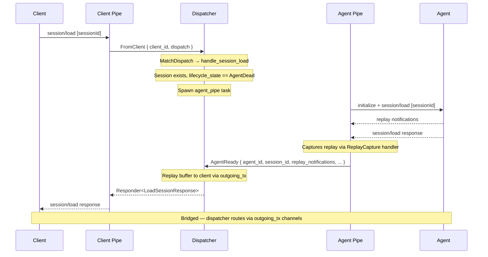
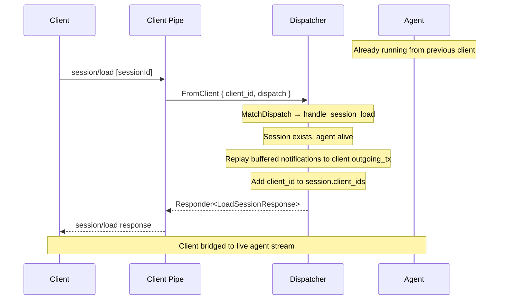
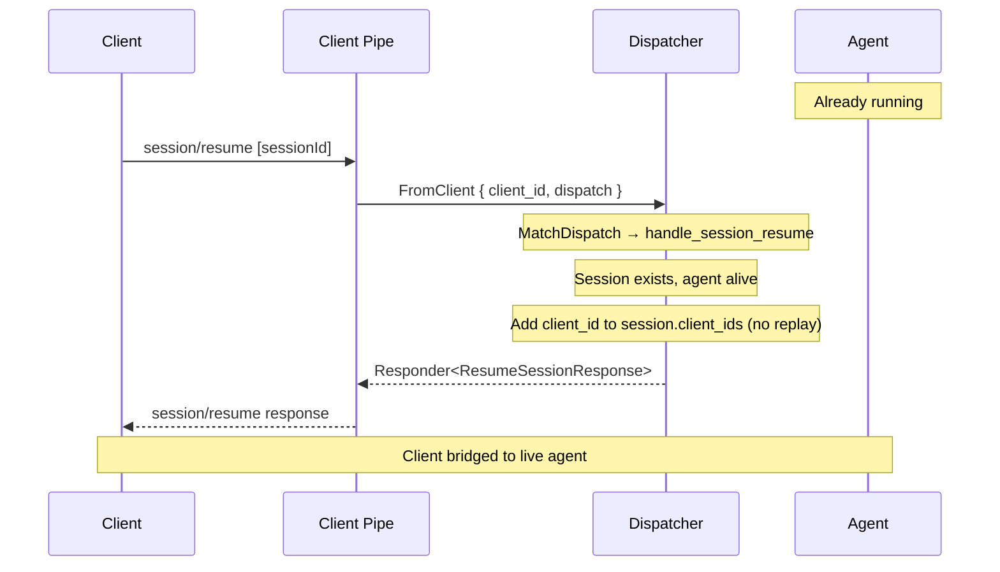

# Reconnect — load and resume

When a client reconnects to an existing session, the dispatcher decides whether to spawn a new agent (dead) or bridge to the existing one (alive). There are two client-facing operations:

- **session/load** — replays buffered history to the client
- **session/resume** — bridges immediately without replay

Both check liveness inline in the dispatcher's handler — no intermediate query message.

## Load session — agent dead

The agent was killed (idle timeout, crash, or cwd deleted). The dispatcher spawns a fresh `agent_pipe` task. The agent pipe sends `session/load` to the agent, captures replay notifications, then sends `AgentReady` back to the dispatcher.



## Load session — agent alive

The agent is still running from a previous client. No spawn needed — the dispatcher replays its in-memory notification buffer to the new client's `outgoing_tx` and wires the client to the session.



## Resume session — agent dead

Same as load-dead: the dispatcher spawns an `agent_pipe` which sends `session/load` to the agent (resume always loads the agent's state). The response comes back as `AgentReady` with a `ResumeSession` responder.

## Resume session — agent alive

Same as load-alive but without replay. The client is wired to the session and picks up the live stream from the current point forward.



## Step by step

### Dispatch

Both `session/load` and `session/resume` arrive as `FromClient` dispatches. The dispatcher's `MatchDispatch` chain routes them to `handle_session_load` or `handle_session_resume`.

```{anchor}
dispatch-session-load
```

### Implementation (load)

The load handler checks liveness inline. If the agent is dead, it spawns an `agent_pipe` task (via `self.tasks.spawn(...)`) which performs the ACP handshake, sends `session/load` to the agent, captures replay notifications, and sends `AgentReady` back. If the agent is alive, it replays the buffer and wires the client immediately.

```{anchor}
handle-session-load
```

### Dispatcher: replay buffered notifications

When `AgentReady` arrives with a `LoadSession` responder, the dispatcher replays the captured notifications to the client via `outgoing_tx.send(Dispatch::Notification(...))`.

## Integration tests

- `session_lifecycle::load_session_after_create` — load after disconnect (agent may still be alive)
- `session_lifecycle::load_nonexistent_session_returns_error` — error path
- `integration::load_live_session_replays_buffer` — load with alive agent, verify replay
- `integration::resume_live_session_bridges_immediately` — resume and prompt immediately
- `integration::load_dead_session_respawns_agent` *(ignored — requires independent agent connections)*
