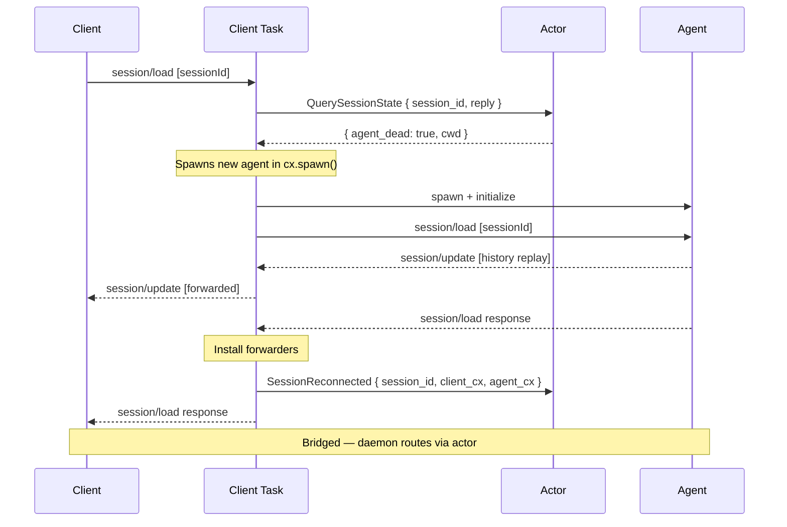
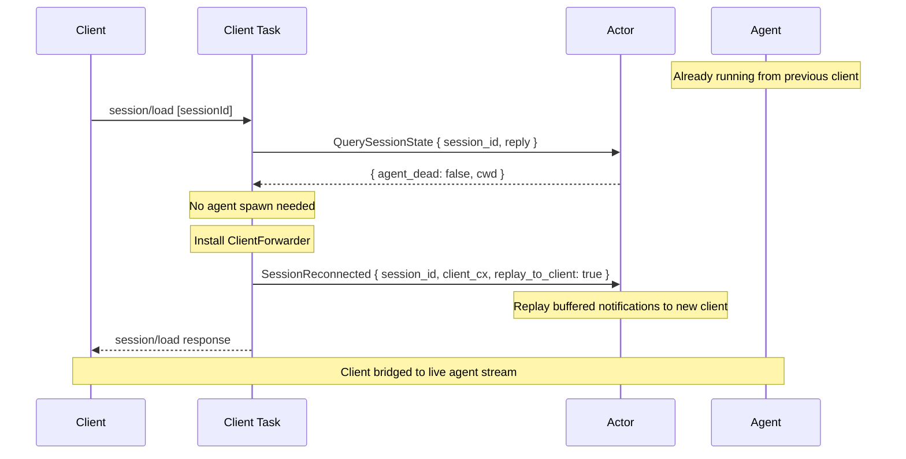
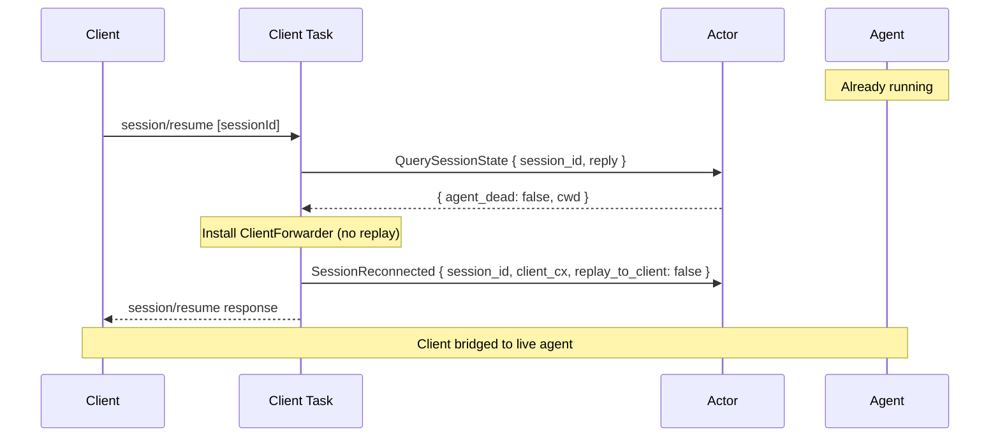

# Reconnect — load and resume

When a client reconnects to an existing session, the daemon decides whether to spawn a new agent (dead) or bridge to the existing one (alive). There are two client-facing operations:

- **session/load** — replays buffered history to the client
- **session/resume** — bridges immediately without replay

Both share the same underlying logic: query the actor for session liveness, then either spawn or rewire.

## Load session — agent dead

The agent was killed (idle timeout, crash, or cwd deleted). The client task spawns a fresh agent and replays history from the agent's own store.



## Load session — agent alive

The agent is still running from a previous client. No spawn needed — the actor replays its in-memory notification buffer to the new client and rewires the forwarders.



## Resume session — agent alive

Same as load-alive but without replay. The client picks up the live stream from the current point forward.



## Step by step

### Dispatch

Both `session/load` and `session/resume` are dispatched from ACP request handlers in the client task. They run inside `cx.spawn()` for `block_task()` safety.

```{anchor}
dispatch-session-load
```

### Implementation (load)

The load handler queries the actor for liveness, then either spawns a new agent (dead branch) or installs a forwarder on the existing connection (alive branch).

```{anchor}
handle-session-load
```

### Actor: replay buffered notifications

When `SessionReconnected` arrives with `replay_to_client: true`, the actor iterates its in-memory buffer and sends each notification to the new `client_cx`.

## Integration tests

- `session_lifecycle::load_session_after_create` — load after disconnect (agent may still be alive)
- `session_lifecycle::load_nonexistent_session_returns_error` — error path
- `integration::load_live_session_replays_buffer` — load with alive agent, verify replay
- `integration::resume_live_session_bridges_immediately` — resume and prompt immediately
- `integration::load_dead_session_respawns_agent` *(ignored — requires independent agent connections)*
