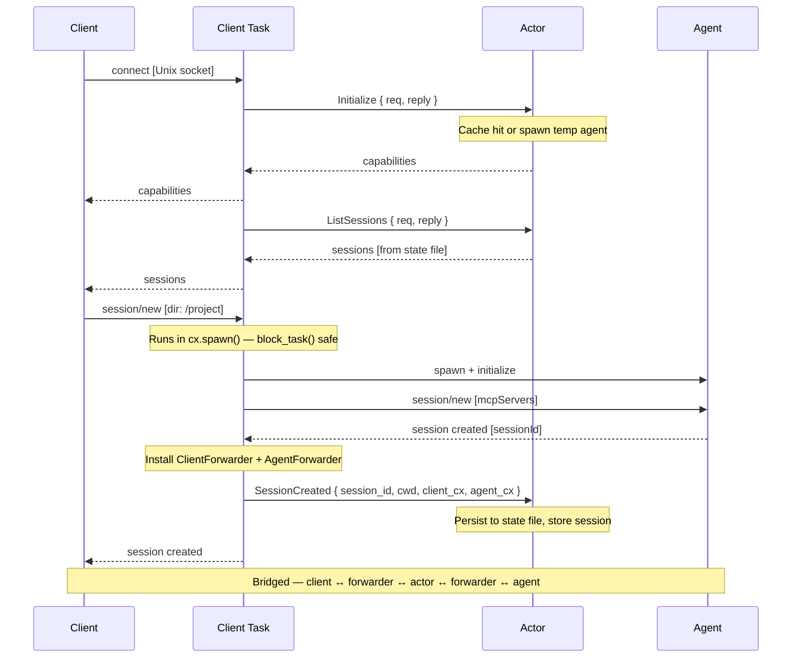
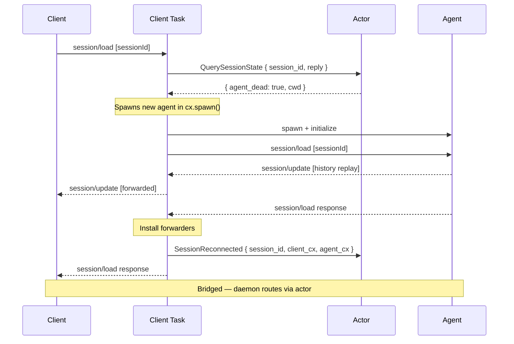
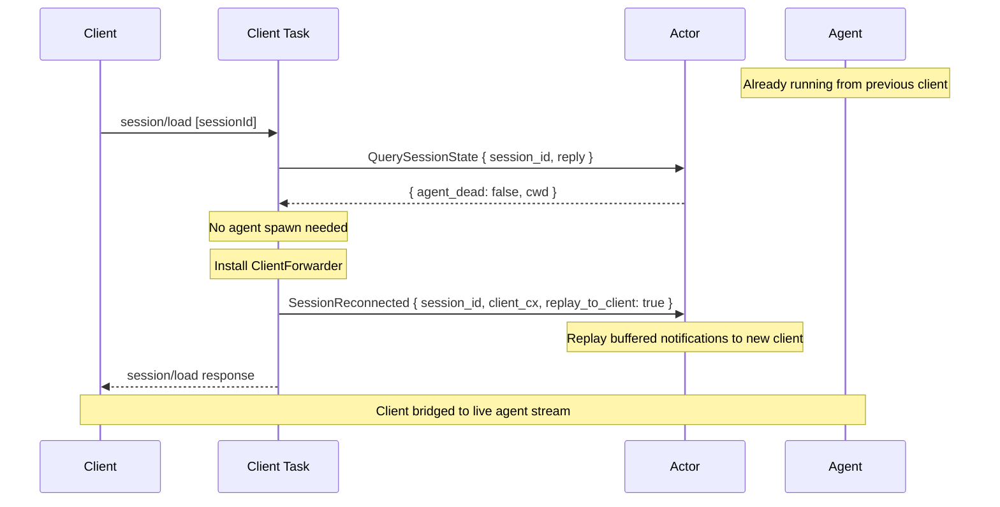
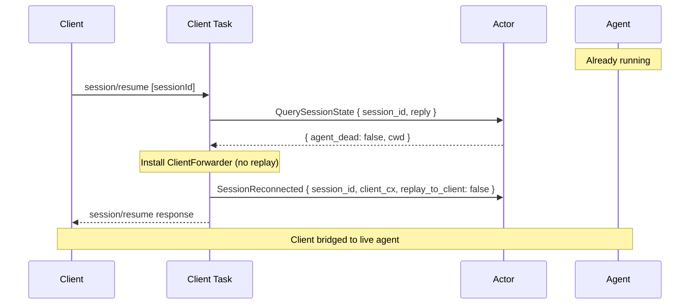
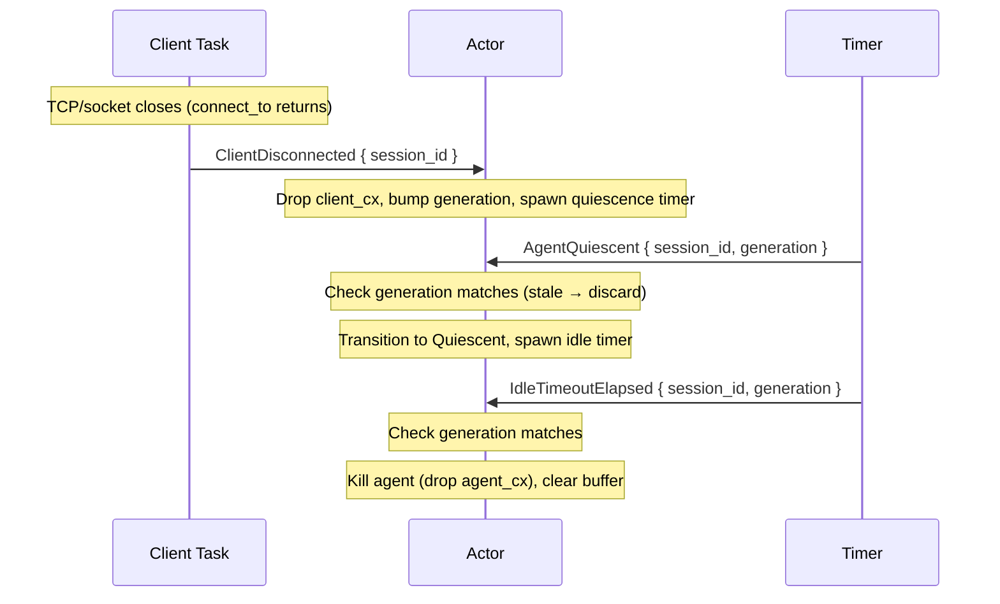
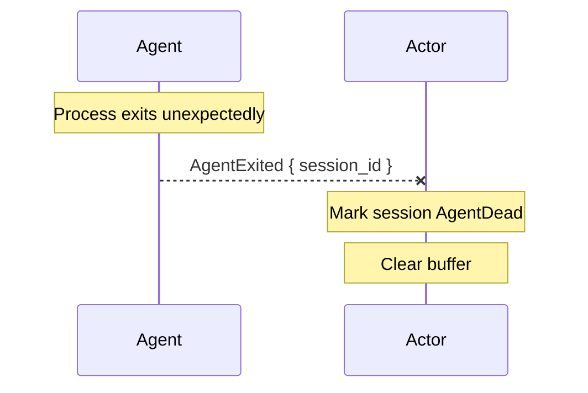
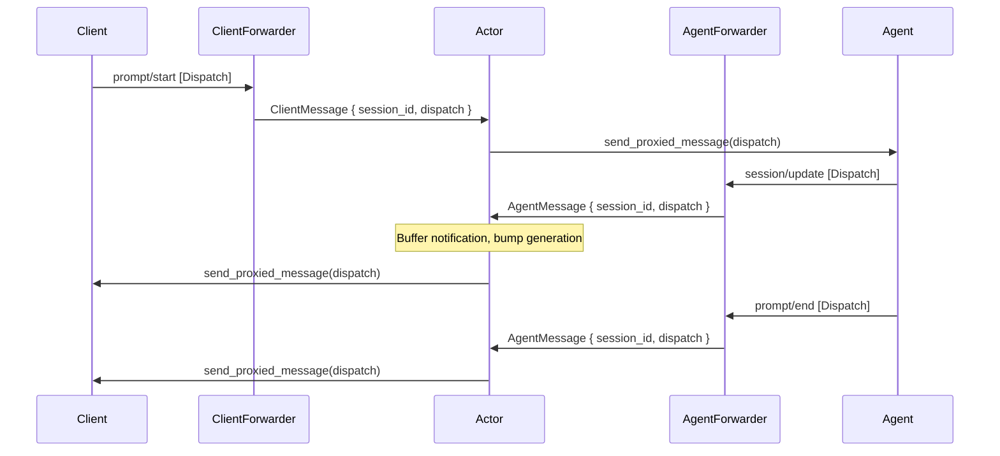
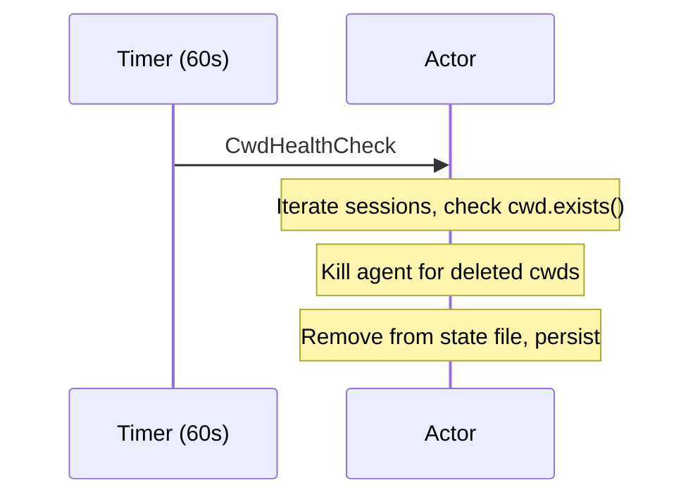

# Key sequence diagrams

## Fresh connection -- new session

Source locations:
- **accept loop** — {anchor}`accept-loop`
- **initialize (dispatch)** — {anchor}`handle-initialize`
- **session/list (dispatch)** — {anchor}`handle-session-list`
- **session/new (dispatch)** — {anchor}`dispatch-session-new`
- **session/new (impl)** — {anchor}`handle-session-new`
- **message routing** — {anchor}`route-messages`

Integration tests:
- `daemon_startup::daemon_creates_socket_file` — connect step (daemon listens on Unix socket)
- `daemon_startup::daemon_accepts_connection_and_responds_to_initialize` — initialize exchange
- `daemon_startup::session_list_returns_empty` — session/list on fresh daemon
- `session_lifecycle::new_session_creates_session_and_returns_id` — full session/new flow through agent
- `session_lifecycle::new_session_persists_to_state_file` — state file persistence after session/new
- `session_lifecycle::session_list_shows_created_session` — session/list after session/new
- `session_lifecycle::new_session_with_invalid_cwd_returns_error` — error path (invalid directory)
- `integration::basic_session_prompt_response` — end-to-end prompt through actor routing
- `integration::multiple_sessions_independent` — two sessions with independent agents

## Reconnect -- load session (agent dead)

Source locations:
- **session/load (dispatch)** — {anchor}`dispatch-session-load`
- **session/load (impl, dead branch)** — {anchor}`handle-session-load`

Integration tests:
- `session_lifecycle::load_session_after_create` — create session, drop connection, load on new connection
- `session_lifecycle::load_nonexistent_session_returns_error` — error path (unknown sessionId)
- `integration::load_dead_session_respawns_agent` *(ignored — requires independent agent connections)*

## Reconnect -- load session (agent alive)

Source locations:
- **session/load (impl, alive branch)** — {anchor}`handle-session-load`
- **replay in actor** — see `handle_session_reconnected` in `actor.rs`

Integration tests:
- `integration::load_live_session_replays_buffer` — load with agent alive, verify buffered messages replay

## Reconnect -- resume session (agent alive)

Integration tests:
- `integration::resume_live_session_bridges_immediately` — resume and prompt immediately on live agent

## Idle spin-down

Source locations:
- **client disconnect (send)** — {anchor}`client-disconnect`
- **quiescence + idle timer (actor)** — {anchor}`disconnect-and-idle`

Integration tests:
- `integration::agent_killed_after_idle_timeout` *(ignored — requires independent agent connections)*

## Agent crash detection

Source locations:
- **agent exit handling** — {anchor}`handle-agent-exited`

Integration tests: *none yet*

## Message flow through the bridge

During normal operation, the actor routes messages bidirectionally via forwarders:

Source locations:
- **message routing** — {anchor}`route-messages`
- **forwarder handlers** — see `ClientForwarder` / `AgentForwarder` in `actor.rs`

Integration tests:
- `integration::basic_session_prompt_response` — full round-trip prompt/response through forwarders

## Directory deleted -- session cleanup

Source locations:
- **periodic timer spawn** — {anchor}`cwd-health-check-timer`
- **cleanup logic** — {anchor}`cwd-health-check`

Integration tests: *none yet*
